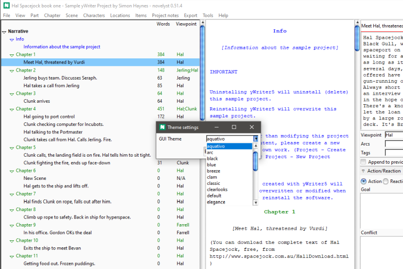

# novelyst_themes

The [novelyst](https://peter88213.github.io/novelyst/) Python program helps authors organize novels.  

*novelyst_themes* is a plugin providing a theme changer dialog. 

## Side note

Actually, the plugin is more intended for Linux, where the default theme looks pretty stale, and there are plenty of desktops, each with a different look.

On Windows, *novelyst* uses a lot of native widgets by default, you can hardly do better with custom themes.
However, if you want a dark theme, another plugin is good for that, which I included with the novelyst add-ons (*novelyst_awdark.py*). That also changes the colors of the tree entries. However, it must not be installed at the same time as this *novelyst_themes* plugin.

## Requirements

- [novelyst](https://peter88213.github.io/novelyst/) version 4.0+
- To have a [wider choice](https://ttkthemes.readthedocs.io/en/latest/themes.html), you may want to [install the ttkthemes package](https://ttkthemes.readthedocs.io/en/latest/installation.html).

## Download and install

[Download the latest release (version 5.0.0)](https://github.com/peter88213/noveltree_themes/raw/main/dist/novelyst_themes_v5.0.0.zip)

- Extract the "novelyst_themes_v5.0.0" folder from the downloaded zipfile "novelyst_themes_v5.0.0.zip".
- Move into this new folder and launch **setup.pyw**. This installs the plugin for the local user.

---

[Changelog](changelog)

## Usage

Start the theme changer from the main menu: **Tools > Theme Changer**.

## License

This is Open Source software, and the *novelyst_themes* plugin is licensed under GPLv3. See the
[GNU General Public License website](https://www.gnu.org/licenses/gpl-3.0.en.html) for more
details, or consult the [LICENSE](https://github.com/peter88213/noveltree_themes/blob/main/LICENSE) file.
